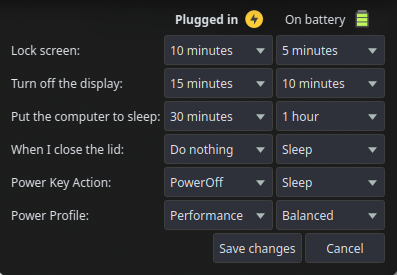

# Pwrctl

> [!WARNING]
> This software is written for personal use. Keep your expectations low.

## Description

Pwrctl is a simple GUI application to control the power management of your system.
It allows you to configure:

- Power profiles (using `powerprofilesctl`)
- Screen lock timeout
- Display turn off timeout
- Sleep timeout
- Lid close action
- Power key action

This is a simple GUI application to control the power management of the system.

[](assets/screenshot.png)

## Requirements

This application requires the following applications to be running:

- `powerprofilesctl`
- `upower`
- `swayidle`
- `systemd-logind`

This application is intended to be used on Sway Wayland compositor or similar compositors.

### Qt Dependencies (Debian/Ubuntu)

```terminal
sudo apt install -y \
    qt6-base \
    qt6-wayland \
    libxcb1 \
    libx11-6 \
    libgl1
```

These dependencies are needed to run the compiled application.

## Building

```terminal
sudo apt install -y \
    build-essential \
    cmake \
    ninja-build \
    git

# Qt6 development packages
sudo apt install -y \
    qt6-base-dev \
    qt6-base-private-dev \
    qt6-tools-dev \
    qt6-wayland \
    libgl1-mesa-dev

# X11/Wayland dependencies
sudo apt install -y \
    libx11-dev \
    libxcb1-dev \
    libxkbcommon-dev \
    libwayland-dev
```

These dependencies are needed to compile the application from source code.

## Usage

After building the application, you can run it by executing the `pwrctl` binary.
The application will start in the system tray. Click on the tray icon to open the settings window.
From there, you can configure the power management settings and save them.
